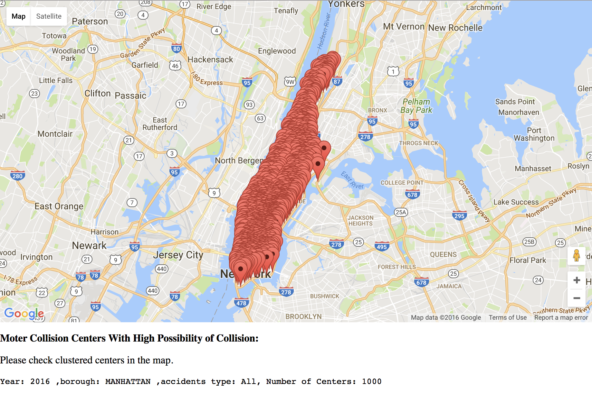
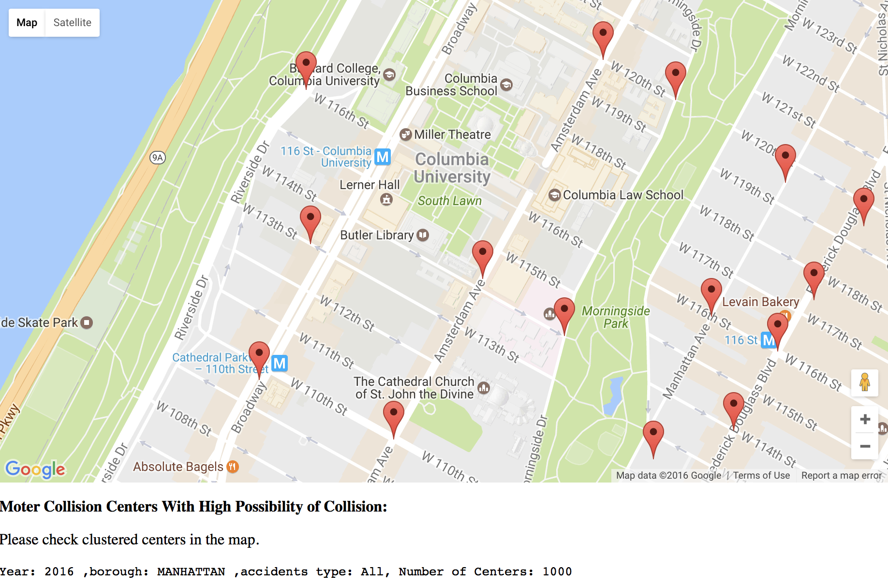

Big data project

Part 1: Statistics Results From Hive Processing

	● Please refer file Part 1.

Part 2: K-mean Clustering for locations of high posibility of accidents

0. Environment

	● OS X, Java 1.8.0_111, python 2.7, Hadoop 2.7.3, Spark 2.0.1, MySQL
	
	● Python packeges: sqlalchemy

1. Download dataset

	● Go to NYC Open Data to download dataset exported as .csv , https://data.cityofnewyork.us/Public-Safety/NYPD-Motor-Vehicle-Collisions/h9gi-nx95, and put it under this project folder.

2. Run command

			python dump2mysql.py
			
			python run.py
			
			#Then follow the instruction to insert year, borough, type of accidents and number of centers (K) you want to cluster.
			
Here is an example of year 2016, manhattan, type = all, K = 100
			

